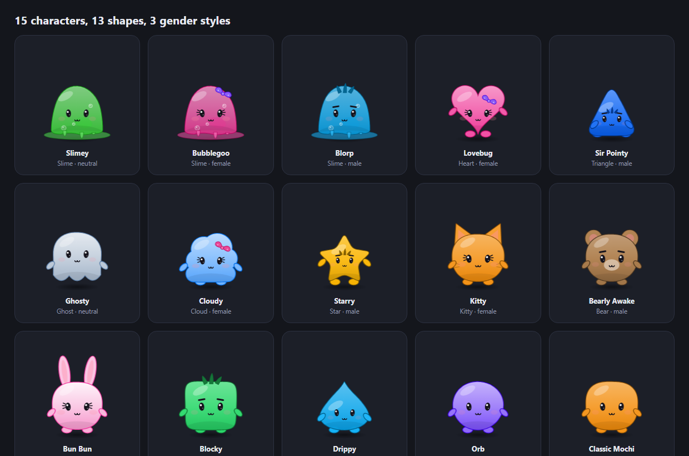
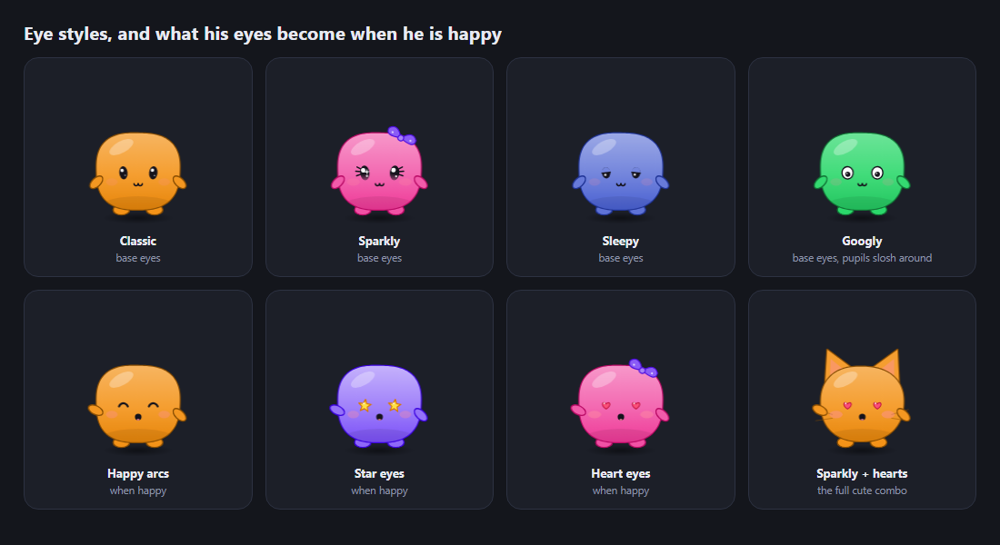
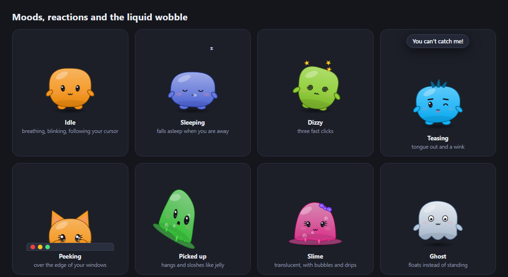
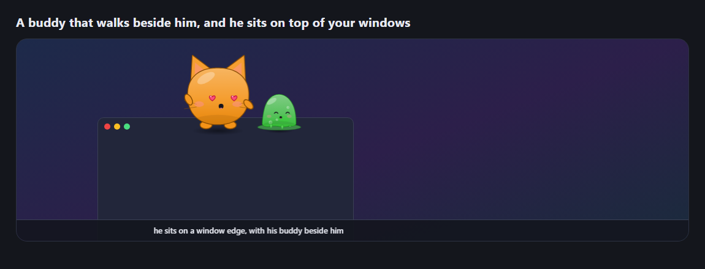
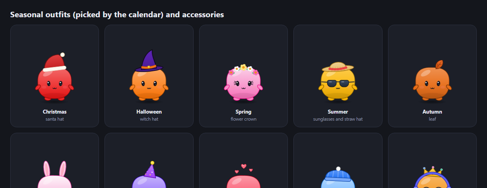
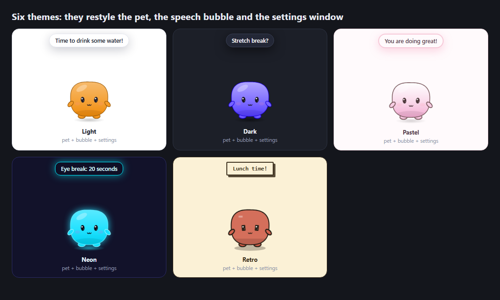
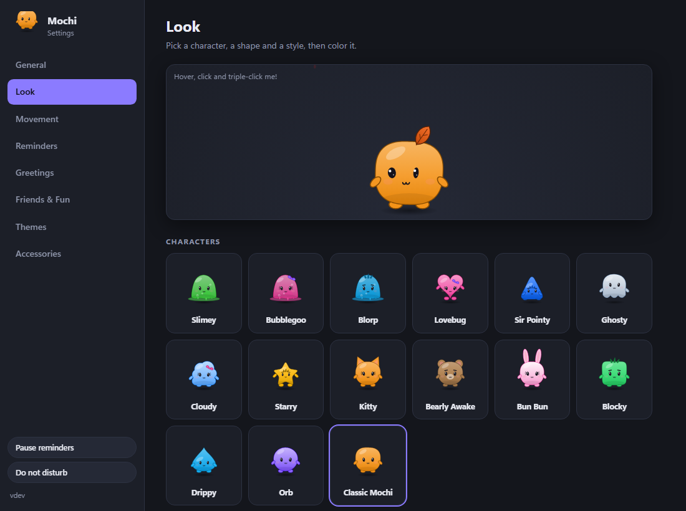
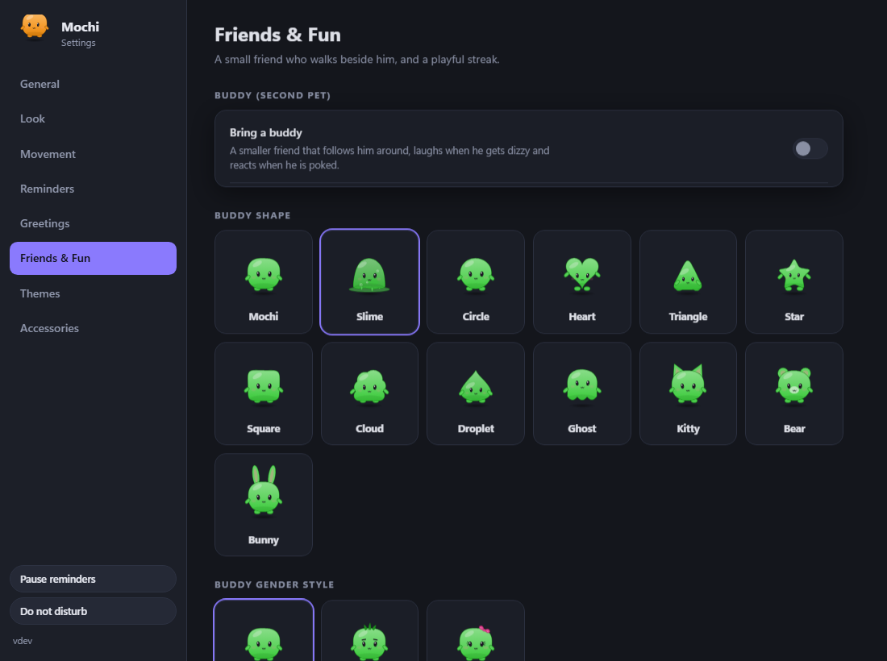
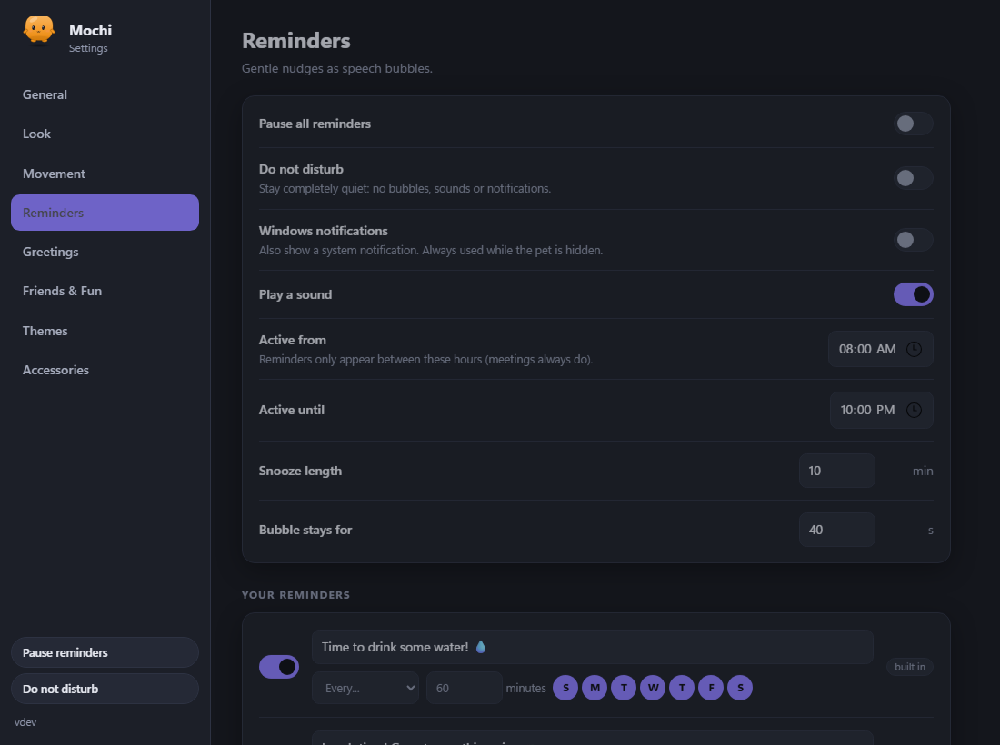
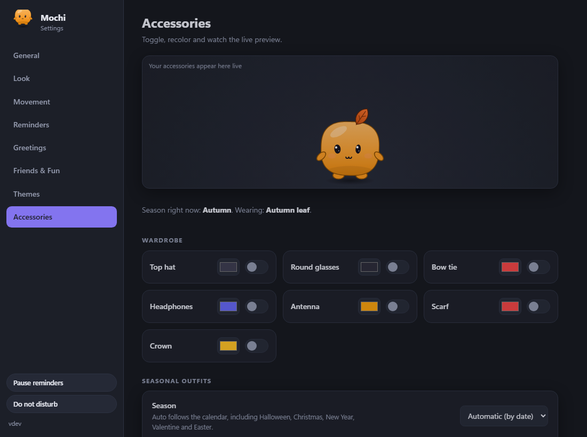

# Mochi

A soft, squishy, jelly-like desktop pet for Windows. He walks around your screen, sits on top of your windows, reminds you to drink water and join meetings, teases you a little, and wobbles like liquid when you pick him up.

Built with [Tauri](https://tauri.app). The whole app is **one ~4 MB `.exe`**. The pet is drawn entirely in code and the sounds are synthesised (no image or audio assets), it runs **fully offline**, and it sends nothing anywhere.



## Contents
- [Download](#download)
- [Features](#features)
- [Screenshots](#screenshots)
- [Using Mochi](#using-mochi)
- [Build from source](#build-from-source)
- [Automatic builds](#automatic-builds-github-actions)
- [Project layout](#project-layout)
- [Privacy](#privacy)
- [Troubleshooting](#troubleshooting)

## Download
Get `Mochi.exe` from the **Releases** page, or from the **Actions** tab (open a run and download the `Mochi-windows-x64` artifact). There is nothing to install: double-click it and he appears. A tray icon appears too.

Needs Windows 10/11 with WebView2 (already part of Windows 11 and up-to-date Windows 10).

> The exe is not code-signed, so Windows SmartScreen may ask you to confirm the first time ("More info" > "Run anyway"). A `Mochi.exe.sha256` file is published next to it so you can verify the download.

## Features

### Characters: 13 shapes, 3 gender styles, 15 ready-made characters
- **Shapes:** mochi, **slime**, circle, **heart**, **triangle**, **star**, square, cloud, droplet, ghost, **cat**, **bear**, **bunny**.
- **Gender style:** neutral, **male** (eyebrows that react, a spiky hair tuft) or **female** (eyelashes, bigger blush, a hair bow).
- **One-click characters:** Slimey, Bubblegoo, Blorp, Lovebug, Sir Pointy, Ghosty, Cloudy, Starry, Kitty, Bearly Awake, Bun Bun, Blocky, Drippy, Orb and Classic Mochi.
- **The slime** is see-through, with bubbles drifting up inside, drips running down the front and a puddle underneath.

### Jelly and liquid motion
- The body outline **ripples and sloshes** like liquid: after every hop, a click, a drop, being picked up, or stopping from a walk.
- Hang him by the cursor and he swings like a pendulum, with his top lagging behind and his feet stretching.
- Two sliders: **Jelly / liquid wobble** (Firm, Bouncy, Jelly, Liquid) and **Squishiness** (how bouncy the springs are). Slime, ghost, cloud and droplet are jellier than the star or the square.

### Eyes
- **Base eyes:** classic, **sparkly** (twinkling glints), **sleepy** (heavy lids, slow blinks) and **googly** (pupils that really slosh and bounce when he hops).
- **When he is happy** his eyes become **happy arcs**, **stars** or **hearts**.
- His eyes follow your cursor, and blink on their own.

### Reactions and moods
- Hover: his eyes grow. Click: he squishes. **Three fast clicks: dizzy** (spiral eyes, orbiting stars).
- **Falls asleep when you are away** (Zzz, slumped body) and wakes up with a hop when you come back.
- A ring pulses around him while a reminder is waiting.

### Movement
- **Modes:** stay still, wander, walk along the taskbar, **sit on top of your windows**, follow the cursor, sit in a corner.
- Settings for speed, how often he moves, which monitors he may use (all, primary, current) and a **never-move lock**.
- **Multiple monitors** are supported, and he **hides and waits** while a fullscreen app, game or presentation is running (reminders wait too).
- Drag him anywhere. In taskbar and windows modes he **falls with gravity** when you let go and lands with a squishy bounce.

### Sits on your windows and peeks over the edge
- In **"Sit on top of my windows"** mode he walks up to the top edge of an open window and stands on it. Edges that other windows cover are ignored.
- **Drag the window and he rides along.** Close or minimise it and he drops to the ground.
- **Throw him anywhere and gravity takes over:** he falls and lands on the window edge under him, or on the ground if there is nothing there.
- Now and then he **ducks behind the window and peeks over the edge**, with his little hands gripping it.

### A buddy: a second pet
- A smaller friend with its **own shape, gender style and colour** that walks beside him.
- It laughs when he gets dizzy or teases you, and bounces when he is poked. Size and side are adjustable.

### Teasing (playful, optional, never blocking)
- **Tongue out with a wink**, and **cheeky remarks** in a speech bubble ("Bleh!", "I saw that."). You can edit every line.
- He never dodges or runs from the mouse: **you can always grab him**, and he stands still while your cursor is on him.
- Poke him too many times, or hover for a long while, and he teases you back.
- Choose **Mild** or **Cheeky**, or switch each part off.

### Reminders
- **Built in:** drink water, lunch, stretch, the 20-20-20 eye break, posture check.
- **Your own:** text, repeat every N minutes **or at fixed times**, on the days you choose.
- **Active hours**, **snooze** and **done** buttons, **do not disturb**, and **pause all**.
- Shown as a speech bubble, with an optional **Windows notification** and a soft **chime**. If the pet is hidden, a notification is used automatically.

### Meeting reminders
- A heads-up **10 minutes before** a meeting (you choose the lead time, or several, like "10, 2"), plus an optional "starting now".
- Add meetings by hand (once, daily, weekdays or weekly), or **link an `.ics` calendar file** exported from Outlook, Google or Apple. It is re-read every 5 minutes, offline. Repeating events (daily / weekly, including `BYDAY`) are understood.
- A list of what is coming up next.

### Greetings
- A bubble that depends on the time: **morning, afternoon, evening, late night**.
- Shown when he starts and on **the first wake-up of each day**. Every line and your name are editable (`{name}` and `{pet}` work).

### Themes: light, dark, pastel, neon, retro, auto
A theme restyles **the pet, the speech bubble and the settings window** together. Auto picks light by day, pastel at dusk and dark at night.

### Accessories and seasons
- **7 everyday accessories:** top hat, glasses, bow tie, headphones, antenna, scarf, crown. Each can be switched on and recoloured, with a live preview.
- **10 seasonal pieces:** santa hat, beanie, flower crown, bunny ears, sunglasses, straw hat, autumn leaf, witch hat, party hat, floating hearts.
- **Seasons follow the calendar** (winter, spring, summer, autumn, plus Halloween, Christmas, New Year, Valentine and Easter), with northern or southern hemisphere, falling snow, petals, leaves, confetti, bats or hearts. Or pin one season. Anything you wear yourself always wins.

### Colours
Fixed colour, a colour picker, a **slow rainbow**, **mood-based**, **time-of-day** or **seasonal**.

### Settings, tray and menus
- Tabs: **General, Look, Movement, Reminders, Greetings, Friends & Fun, Themes, Accessories.**
- Name, size, sounds and volume, start with Windows, always-on-top, how long until he falls asleep, **export / import / reset** of all settings (one JSON file).
- **Tray icon:** show/hide, settings, pause reminders, do not disturb, quit.
- **Right-click the pet** for a quick menu: say hi, settings, do not disturb, pause reminders, movement mode, lock, hide, quit.

## Screenshots

**Eyes: classic, sparkly, sleepy, googly, and what they become when he is happy**


**Moods, reactions and the liquid wobble**


**Sitting on a window edge, with a buddy beside him**


**Seasonal outfits and accessories**


**Themes**


**Settings**

| Look | Friends & Fun |
| --- | --- |
|  |  |
| **Reminders** | **Accessories** |
|  |  |

> These images are generated from the real drawing code by `npm run screenshots` (see below), so they always match the app. A screen recording works well too: drop it in `docs/` and link it here.

## Using Mochi
- **Drag** him anywhere. **Click** to squish him, **triple-click** to make him dizzy, **right-click** for the quick menu.
- **Tray icon:** click to hide or show, double-click for settings.
- Settings are saved as `settings.json` in `%APPDATA%\com.mochi.pet`. Use **Export / Import** in General to move them between computers.
- `Mochi.exe --settings` opens the settings window on start.

## Build from source
Needs [Node.js](https://nodejs.org) 20+, [Rust](https://rustup.rs) and the Visual Studio C++ Build Tools.

```
npm install
npm run dev           # run from source
npm run build         # -> src-tauri/target/release/mochi.exe  (single exe, ~4 MB)
npm test              # 19 Rust unit tests: reminders, meetings, .ics, settings validation, window edges, gravity
npm run preview       # the pages in a normal browser with a mock backend (visual testing)
npm run screenshots   # regenerate docs/screenshots (needs Edge or Chrome)
```

## Automatic builds (GitHub Actions)
[`.github/workflows/build.yml`](.github/workflows/build.yml) builds the exe for you on a Windows runner:

| When | What happens |
| --- | --- |
| Push to `main` / `master`, pull request, or **Run workflow** button | Runs the tests, builds `Mochi.exe`, uploads it as the **`Mochi-windows-x64`** artifact (kept 30 days) |
| Push a tag like `v1.0.1` | Same, and also creates a **GitHub Release** with `Mochi.exe` and `Mochi.exe.sha256` attached |

To publish a release:
1. Bump the version in **both** `src-tauri/tauri.conf.json` and `src-tauri/Cargo.toml` (the workflow checks that the tag matches them and fails if not).
2. `git tag v1.0.1 && git push origin v1.0.1`

## Project layout
- `src-tauri/src` - the Rust app: windows, movement physics, window detection, reminder and meeting engine, tray, settings store. `defaults.json` is the single source of default settings.
- `src/renderer/pet`, `src/renderer/settings` - the pet window (used for him and the buddy) and the settings window: plain HTML, CSS and JS, no framework.
- `src/renderer/shared` - the character: shapes, jelly physics, eyes, accessories, themes, seasons, and `bridge.js` (`window.api`).
- `src/shared/ipc.d.ts` - the typed contract between the pages and the app. The Rust side rejects any other message.
- `src/renderer/dev`, `scripts/` - the preview server, the screenshot generator and a helper for inspecting the running app.

## Privacy
Fully offline. No telemetry, no accounts, no network requests (the web views are not allowed to make any). Settings and your calendar file stay on your computer. The only things read from other apps are the **position of their windows** (so he can sit on them) and whether a **fullscreen app** is running.

## Troubleshooting
- **He does not appear:** check the tray icon (he may be hidden), and that WebView2 is installed.
- **He is not sitting on a window:** set Movement > Mode to "Sit on top of my windows". Maximised windows are skipped because there is no room above them.
- **He walks off-screen on a second monitor:** set Movement > Allowed area to "Primary monitor only".
- **He is too jumpy or too wobbly:** lower **Jelly / liquid wobble** and **Squishiness** in Look, or lower the teasing level in Friends & Fun.
- **SmartScreen warning:** the exe is unsigned. Check the SHA-256 against the release, then choose "Run anyway".
